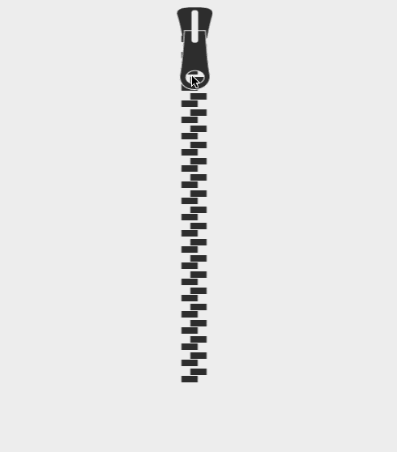

# react-zipper 

React component that renders a dynamic Zipper SVG. The zipper can be dragged, revealing a short hidden meddage underneath

**Credit**: [Original Zipper SVG animation by Chris Gannon](http://codepen.io/chrisgannon/pen/aOJxeo)



## Running Locally

### Install dependencies

You will need either [yarn](https://yarnpkg.com/) or [npm](https://www.npmjs.com/) to build the React component. Respectively run `npm install` or `yarn` to install the necessary dependencies.

### Build the app

```sh
npm run build
```

### Run the demo

Place the `browser/build/index.html` file in a browser and tada! You have a functioning React zipper component.

To adjust the number of zipper teeth, style (i.e. colors), and more, update the input `Zipper` props inside the `browser/src/index.js` file and re-build the module.